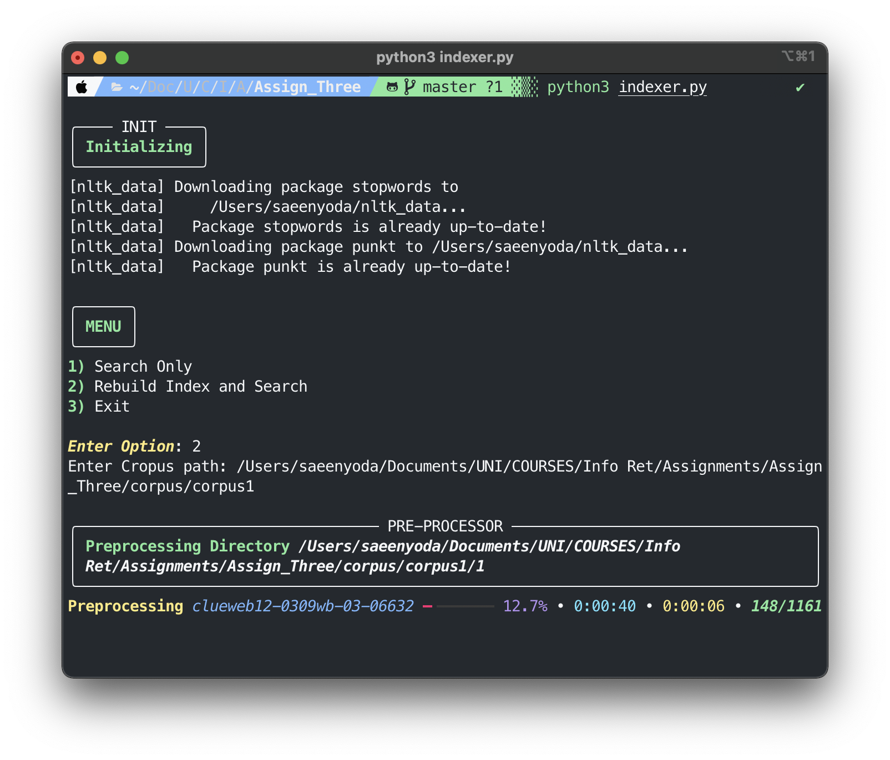
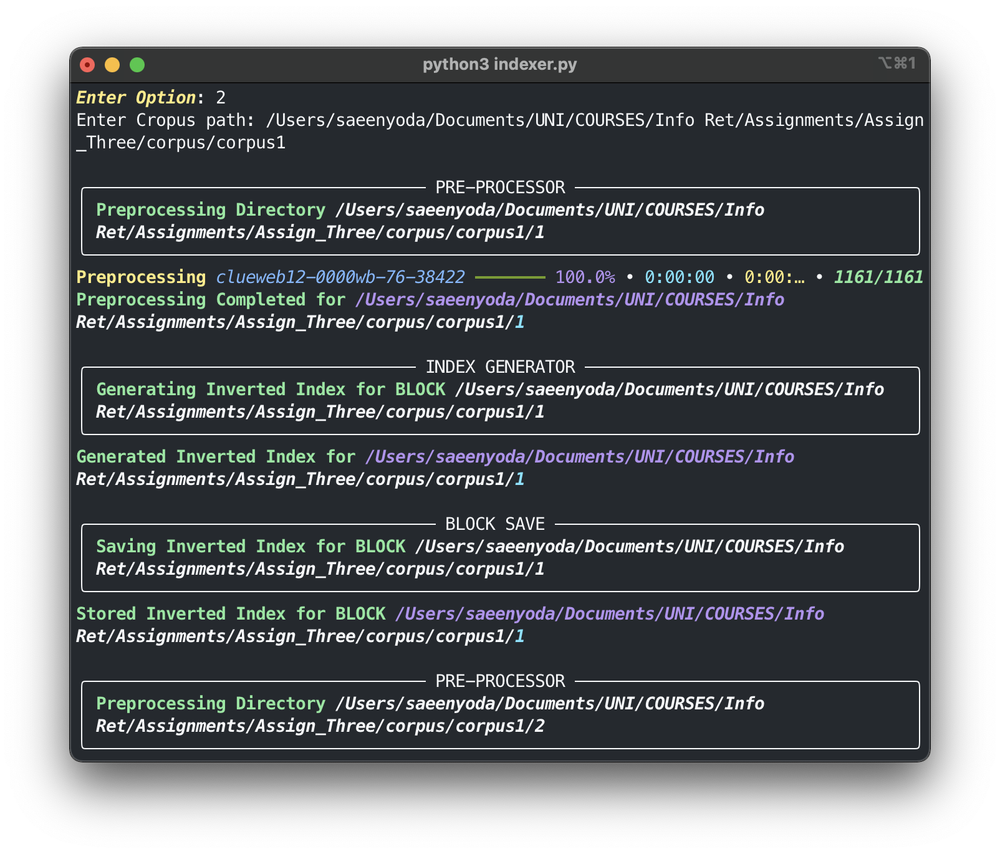
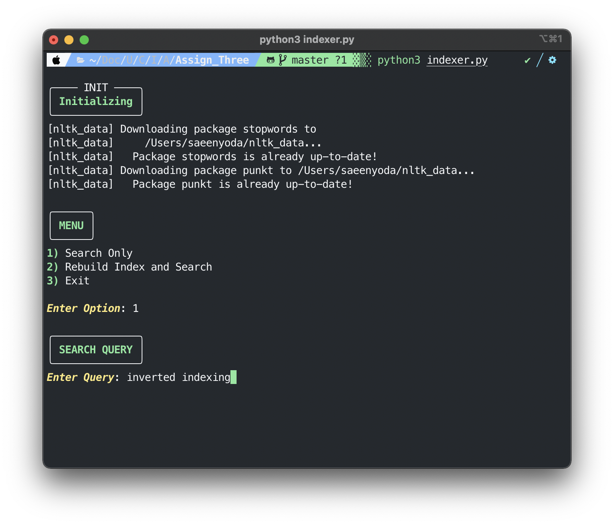
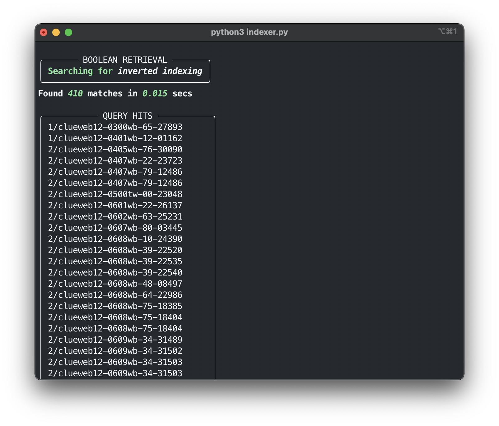

[![MIT License][license-shield]][license-url]

<!-- PROJECT LOGO -->
<br />
<p align="center">
  <a href="https://github.com/github_username/repo_name">
    
  </a>

  <h3 align="center">Inverted Indexer</h3>

  <p align="center">
  An Inverted Indexer written in Python
  </p>
</p>


<!-- TABLE OF CONTENTS -->
<details open="open">
  <summary><h2 style="display: inline-block">Table of Contents</h2></summary>
  <ol>
    <li>
      <a href="#about-the-project">About The Project</a>
      <ul>
        <li><a href="#built-with">Built With</a></li>
      </ul>
    </li>
    <li>
      <a href="#getting-started">Getting Started</a>
      <ul>
        <li><a href="#prerequisites">Prerequisites</a></li>
        <li><a href="#installation">Installation</a></li>
      </ul>
    </li>
    <li><a href="#usage">Usage</a></li>
    <ul>
        <li><a href="#how-to-run">How to Run</a></li>
        <li><a href="#example-images">Example Images</a></li>
      </ul>
    <li><a href="#license">License</a></li>
  </ol>
</details>


<!-- ABOUT THE PROJECT -->
## About The Project

This creates an <a href="https://en.wikipedia.org/wiki/Inverted_index"><i>Inverted Index</i></a> for the given Corpora. 
Inverted Index is a mapping of content (Words, Numbers etc) to its location in a document(s) and is used for fast full text searching. 
This python script creates a word-level inverted index. 


### Built With

* [Python](https://www.python.org)
* [Rich](https://github.com/willmcgugan/rich)
* [NLTK](http://www.nltk.org)


<!-- GETTING STARTED -->
## Getting Started

To get a local copy up and running follow these simple steps.

### Prerequisites

* [Python3](https://www.python.org/downloads/)

### Installation

1. Clone the repo
   ```sh
   git clone https://github.com/saeenyoda/Inverted_Indexing.git
   ```
2. Install Requirements
   ```sh
   pip3 install -r requirements.txt
   ```


<!-- USAGE EXAMPLES -->
## Usage

### How to Run
1. Open up command line or terminal and navigate to the cloned repo's directory
   ```sh
   cd "PATH-TO-DIRECTORY"
   ```
2. Run the indexer.py file (use python if you have created it as an alias for python3)
   ```sh
   python3 indexer.py
   ```

This will present you with the following Menu Screen:


Now enter a number corresponding to the given Menu Options:
    <ol>
    <li> Search Only: If you have already created the inverted index, you can simply search.
    <li> Rebuild Index and Search: If you want to rebuild index, or create it for the first time, and then search. This will ask for a path to the corpus.
    <li> Exit: Simply Exit the program.
    </ol>
    
   ***NOTE:***  
   &nbsp;&nbsp;&nbsp;&nbsp;&nbsp;&nbsp;`The Corpora can have subdirectories, path in Menu Option 2 has to be for the root directory. Each Subdirectory will be merged once preprocessed and saved  seprately.`
    
    
### Example Images
* When a subdirectory is being preprocessed
  
* When the inverted index for that subdirectory is being stored
  
* Asks for Query
  
* Shows documents found, time taken and document names
  

<!-- LICENSE -->
## License

Distributed under the MIT License. See `LICENSE` for more information.


<!-- MARKDOWN LINKS & IMAGES -->
<!-- https://www.markdownguide.org/basic-syntax/#reference-style-links -->
[license-shield]: https://img.shields.io/github/license/saeenyoda/Inverted_Indexing?label=license&style=for-the-badge
[license-url]: https://github.com/saeenyoda/Inverted_Indexing/blob/master/LICENSE
